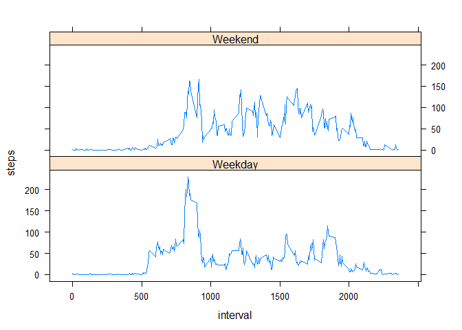

## Loading and preprocessing the data
It is assumed that the zip file of raw data is in the current working directory. After unzipping one file the resulting file will have an *.csv extension. The csv file is read into R as a dataframe called "activity."
The activity dataframe is preprocessed by converting the date variable into a date class.


```r
library(dplyr)
library(tidyr)
library(lubridate)
library(xtable)
library(ggplot2)
library(stats)
library(lattice)
zipfile <- dir()[grep("zip",dir())]             #get the zip file name
unzip(zipfile)                            #unzip in current directory
activity <- read.csv("activity.csv",sep = ",")
activity$date <- date(activity$date)
```


## What is mean total number of steps taken per day?

### Plot a histogram of the total steps per day

First, group data by day. If the lubridate package function qday() is applied to the $date variable in the activity dataframe, the day of the quarter is returned. There are 61 unique days. To create the histogram data, the steps for each day are summed. NAs are ignored.

```r
#add a column for unique date in quarter
activityWQtr <- activity %>% mutate(qtr = qday(date))
dailySums <- aggregate(steps ~ qtr, data = activityWQtr, FUN = sum, na.action = na.omit )
```

Create the histogram:

```r
hist(dailySums$steps,
     main = "Frequency of steps per day",
     xlab = "Steps in a day",
     col = rgb(0,1,1,.2))
```

<!-- -->

### Mean and median of the total number of steps per day.


```r
aveStepsPerDay <- mean(dailySums$steps)
medStepsPerDay <- median(dailySums$steps) 
print(aveStepsPerDay)
```

```
## [1] 10766.19
```

```r
print(medStepsPerDay)
```

```
## [1] 10765
```

The **mean** is **10766.19** steps and the **median** is **10765** steps.

## What is the average daily activity pattern?

### Plot average steps/interval averaged across all days

Find the averages for each 5 min time interval. Note there are 288 intervals that represent 5 minute time bins. These 288 intervals repeat every day. This data will be plotted.

```r
intervalAves <- aggregate(steps ~ interval , data = activityWQtr, 
                          FUN = mean, na.action = na.omit )
```

We would like to see time on the x-axis, not an interval number. A for loop was used to convert the interval into an hour:min format for the plot. For example, interval = 115 means 1 hour and 15 minutes since midnight has elapsed. 


```r
t<-data.frame()
for (m in seq(1,288,by = 24)){
  ti <- c(paste0(intervalAves$interval[m]%/%100,":",intervalAves$interval[m] %% 100),
          intervalAves$interval[m])
  t <- rbind(t,ti)
}
colnames(t) <- c("hr_min","interval")

p2 <- ggplot(intervalAves, aes(interval,steps))+
  geom_line()+
  xlab("interval, minutes")+
  ylab("Average steps")+
  scale_x_continuous("time, hourly",breaks = seq(1,2355,by = 200),labels = t$hr_min)+
  labs(title = "Average steps per 5 minute interval")

print(p2)
```

<!-- -->
### Which interval contains max number of steps?
Interval with the most steps is not the same as the interval with the highest average number of steps. (A simple plot will prove this)


```r
intervalMaxIndex <- which.max(activityWQtr$steps )  #16492
mostSteps <- activityWQtr$step[intervalMaxIndex]    #806
intervalMax <- activityWQtr$interval[intervalMaxIndex]  #615
intervalMaxTime <-paste0(intervalMax%/%100,":",
                          intervalMax%% 100)
print(intervalMax)
```

```
## [1] 615
```

```r
print(intervalMaxTime)
```

```
## [1] "6:15"
```

The 5 minute interval with the highest number of steps is **615**. This corresponds to the time **6:15**. The max number of steps in an interval is **806**.

## Imputing missing values

### Calculate and report the total number of missing values in the dataset (i.e. the total number of rows with NAs)


```r
NAsTot <-sum(is.na(activityWQtr$steps))  #could also use summary()
print(NAsTot)
```

```
## [1] 2304
```

There are **2304 missing values** or NAs in the steps variable.

### Replace NAs with mean of the interval. 
Note there are 288 intervals (and 61 days).
After the replacement, a summary is done to show the new variable 'newSteps', contains no NAs.


```r
activityNoNA <-data.frame()
for (i in 1:288) {
  NoNAdata <- activityWQtr %>% subset(interval == interval[i]) %>%
    mutate(newSteps = replace_na(steps,intervalAves$steps[i]))
  activityNoNA <-rbind(activityNoNA,NoNAdata)
}
summary(activityNoNA)
```

```
##      steps             date               interval           qtr        newSteps     
##  Min.   :  0.00   Min.   :2012-10-01   Min.   :   0.0   Min.   : 1   Min.   :  0.00  
##  1st Qu.:  0.00   1st Qu.:2012-10-16   1st Qu.: 588.8   1st Qu.:16   1st Qu.:  0.00  
##  Median :  0.00   Median :2012-10-31   Median :1177.5   Median :31   Median :  0.00  
##  Mean   : 37.38   Mean   :2012-10-31   Mean   :1177.5   Mean   :31   Mean   : 37.38  
##  3rd Qu.: 12.00   3rd Qu.:2012-11-15   3rd Qu.:1766.2   3rd Qu.:46   3rd Qu.: 27.00  
##  Max.   :806.00   Max.   :2012-11-30   Max.   :2355.0   Max.   :61   Max.   :806.00  
##  NA's   :2304
```

### New histogram of total number of steps each day, new mean and medians.
The new histogram appears similar to the original, which omitted the NAs.


```r
dailySumsNoNA <- aggregate(newSteps ~ qtr, data = activityNoNA, FUN = sum )
aveStepsPerDayNoNA <- mean(dailySumsNoNA$newSteps)
medStepsPerDayNoNA <- median(dailySumsNoNA$newSteps) 
hist(dailySumsNoNA$newSteps,
     main = "Frequency of steps per day",
     xlab = "Steps in a day",
     col = rgb(1,0,1,.2))
```

<!-- -->

The **mean** is **10766.19** steps and the **median** is **10766.19** steps with the imputed data.

Previously,the **mean** is **10766.19** steps and the **median** is **10765** steps.

### Impact of Imputing
The mean is exactly the same as before, when the NAs were omitted. We can understand this with a simple math example, shown below. The new median does change a small amount, with it being slightly increased due to more data above 0. Imputing missing values with the mean is the simplest method. It does not reduce the data set, and can introduce some variance bias.


```r
 x = c(1,2,3,4,NA,NA)
avex = mean(x, na.rm = TRUE)
print(avex)
```

```
## [1] 2.5
```

```r
newx = c(1,2,3,4,avex, avex)
print(mean(newx))
```

```
## [1] 2.5
```

## Are there differences in activity patterns between weekdays and weekends?
The data with imputed values for NAs in the steps was used for this analysis. 

### Create a new factor variable with two levels- "weekday" and "weekend".
The code is shown below. The head() command shows the new variable 'wkday' with two levels.


```r
# Add a column that contains the day of the week, numeric 1 -7 for Sunday - Saturday
activityNoNAw <- activityNoNA %>% mutate(wkday <-wday(date))
colnames(activityNoNAw)[(colnames(activityNoNAw)=='wkday <- wday(date)')]<-"wkday"

# function that assigns "weekend" or "weekday" to numeric 1,7 or 2-6
isItwday <- function(d) {
  if (d == 1| d == 7) ans <- "weekend"
  else ans <- "weekday"
  return(ans)
}

#Create variable wkday whose value is either "weekend" or "weekday" 
activityNoNAw$wkday <- lapply(activityNoNAw$wkday,isItwday)
head(activityNoNAw)
```

```
##   steps       date interval qtr  newSteps   wkday
## 1    NA 2012-10-01        0   1  1.716981 weekday
## 2     0 2012-10-02        0   2  0.000000 weekday
## 3     0 2012-10-03        0   3  0.000000 weekday
## 4    47 2012-10-04        0   4 47.000000 weekday
## 5     0 2012-10-05        0   5  0.000000 weekday
## 6     0 2012-10-06        0   6  0.000000 weekend
```

### Make a panel plot containing a time series to compare weekdays and weekends.

The x-axis is the 5 minute interval data, and the y-axis is the average number of steps take in the interval across the weekdays or the weekend days.


```r
#Subset the weekdays data and find interval means:
actWday <- activityNoNAw %>% filter(wkday == "weekday")
actWdayMean <- aggregate(newSteps ~ interval, data = actWday,FUN = mean)
colnames(actWdayMean) <- c("interval","weekDayMeanSteps")

#Subset the weekends data and find interval means:
actWend <- activityNoNAw %>% filter(wkday == "weekend")
actWendMean <- aggregate(newSteps ~ interval, data = actWend,FUN = mean)
colnames(actWendMean) <- c("interval","weekEndMeanSteps")

colnames(actWdayMean) <- c("interval","steps")
colnames(actWendMean) <- c("interval","steps")
panelPlotdata <-rbind(cbind(actWdayMean,wkday =rep("Weekday",288)),
                      cbind(actWendMean,wkday =rep("Weekend",288)))

p3 <- xyplot(steps~interval | wkday, data = panelPlotdata, layout= c(1,2),type = 'l')
print(p3)
```

<!-- -->

*This took me much longer than 1:40 that coursera says is average. Please tell me your time invested on this assignment. I am just curious. I am detailed, so maybe I take longer. I will guess I have 6 hours invested in this assignment (because I work full time and my R time is very broken). Share with me if you can. ~ Aloha.*
